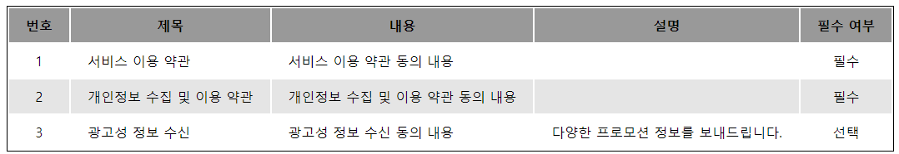

## JavaScript 배열 함수 연습

<br/>

- 배열 함수를 익히기 위한 연습 문제입니다.
- 각 문제에서 언급한 조건을 참고하여 문제를 풀어 주세요.
- 각 문제의 출력값은 `Expected value` 와 **완전히 동일**해야 합니다.

<br/>

---
<br/>
<br/>

1. 다음과 같이 순서가 없는 숫자들이 배열로 이루어져 있다.<br/>
작은 수부터 큰 수까지 한 눈에 보이도록 오름차순 정렬하여 배열로 출력하시오.
> Original value:
```javascript
[ 5, 8, 4, 9, 2, 1, 3, 6, 0, 7, 10 ]
```

> Expected value:
```javascript
[ 0, 1, 2, 3, 4, 5, 6, 7, 8, 9, 10 ]
```
<br/>
<br/>

2. 다음 배열의 각 요소는 기본적으로 천단위가 적용되어 있는 요소들이다.<br/>
천단위를 없애고 직접 1,000을 곱하여 새로운 배열로 출력하시오.
> Original value:
```javascript
[ 1, 3, 5, 7, 9 ]
```

> Expected value:
```javascript
[ '1,000', '3,000', '5,000', '7,000', '9,000' ]
```
<br/>
<br/>

3. 다음 배열의 요소들의 텍스트를 일괄 변경하려고 한다.<br/>
가장 앞 글자를 대문자로 바꾸고, 가장 뒤 문자에 `, js` 문자열을 포함하여 출력하시오.
> Original value:
```javascript
[ 'hello', 'hi', 'welcome', 'great', 'awesome' ]
```

> Expected value:
```javascript
[ 'Hello, js', 'Hi, js', 'Welcome, js', 'Great, js', 'Awesome, js' ]
```
<br/>
<br/>

4. 다음 배열의 요소들 중 5글자 이상인 요소들을 찾아 새로운 배열로 출력하시오.
> Original value:
```javascript
[ 'node', 'go', 'c', 'java', 'python' ,'csharp', 'spring' ]
```

> Expected value:
```javascript
[ 'python', 'csharp', 'spring' ]
```
<br/>
<br/>

5. 게시판에서 한 줄에 표시하기에 너무 긴 문장을 끊어서 표시하려고 한다.<br/>
50글자가 넘어가는 글자일 경우 51글자부터는 `...` 으로 표시하시오.
> Original value:
```javascript
[
    'Lorem Ipsum is simply dummy text of the printing and typesetting industry.',
    "Lorem Ipsum has been the industry's standard dummy text ever since the 1500s,",
    'when an unknown printer took a galley of type and scrambled it to make a type specimen book.',
    'It has survived not only five centuries,'
]
```

> Expected value:
```javascript
[
    'Lorem Ipsum is simply dummy text of the printing a...',
    "Lorem Ipsum has been the industry's standard dummy...",
    'when an unknown printer took a galley of type and ...',
    'It has survived not only five centuries',
]
```
<br/>
<br/>

6. 다음 객체에서 items 요소를 한 항목씩 웹 페지이지에 출럭하시오.
> 이 문제는의 `CSS` 결과물은 `Expected value` 와 동일하지 않아도 되며, 출력된 값의 형태 (`HTML`, `JavaScript`) 만 같으면 됩니다.
```javascript
[
    {
        "id": 1,
        "title": "서비스 이용 약관",
        "content": "서비스 이용 약관 동의 내용",
        "description": "",
        "isRequired": true
    },
    {
        "id": 2,
        "title": "개인정보 수집 및 이용 약관",
        "content": "개인정보 수집 및 이용 약관 동의 내용",
        "description": "",
        "isRequired": true
    },
    {
        "id": 3,
        "title": "광고성 정보 수신",
        "content": "광고성 정보 수신 동의 내용",
        "description": "다양한 프로모션 정보를 보내드립니다.",
        "isRequired": false
    }
]
```
